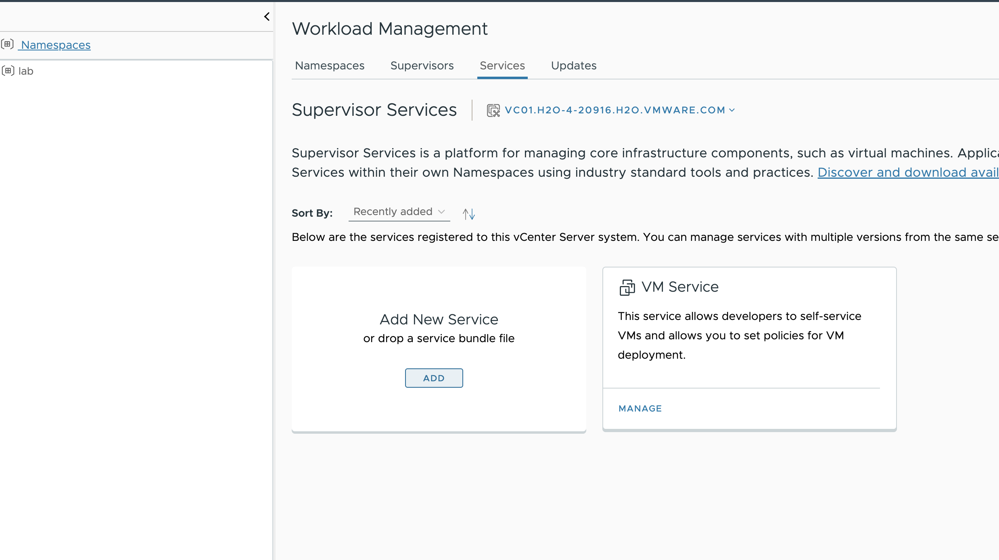
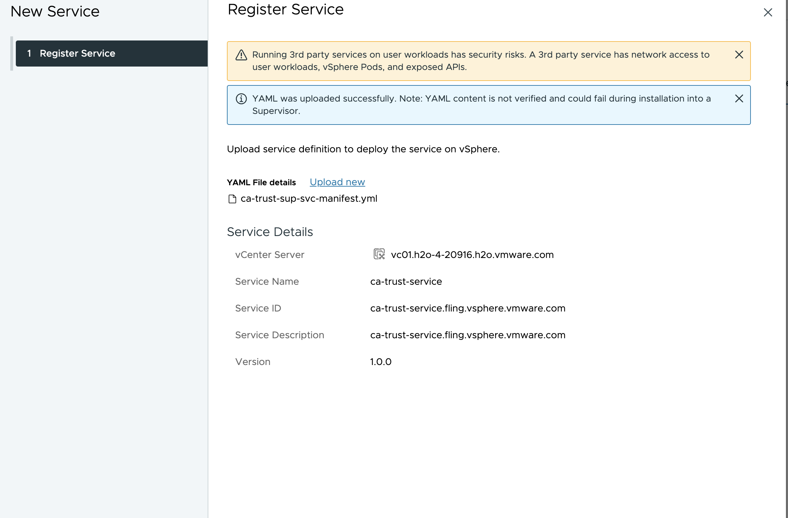
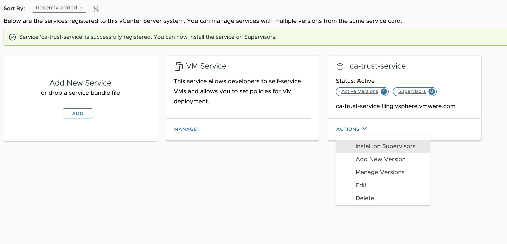
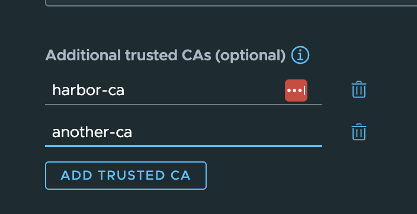

# CA Trust Service

This is a supervisor service that can be used to automatically create cluster specific secrets for use with the `additionalTrustedCAs` field. 

## Why this is needed
 As of writing this, in order to add trusted CAs to a cluster when using the `v1beta1` api a secret needs to be created for each cluster with the CAs added into that secret, then the secret's data can be referenced from the `additionalTrustedCAs` field in the cluster spec([see docs here](https://docs.vmware.com/en/VMware-vSphere/8.0/vsphere-with-tanzu-tkg/GUID-EC2C9619-2898-4574-8EF4-EA66CFCD52B9.html#v1beta1-api-example-3)). When using this with TMC this becomes a problem becuase you need to log into the supervisor cluster and create a secret every time a cluster is created. This makes automation problematic. 


## How it works

 This service deploys the [metacontroller](https://metacontroller.github.io/metacontroller/intro.html), an opensource project that makes it very simple to create a K8s controller. Additionally it deploys a simple controller written in python that utilizes the [DecoratorController](https://metacontroller.github.io/metacontroller/api/decoratorcontroller.html) to watch for cluster objects being created and generates a secret following the required naming convention(`<cluster-name>-user-trusted-ca-secret`). The source for the generated secret is another secret in the same namespace as the cluster that is required to be named `ca-trust-service-secret` . This allows for one secret to be created per namespace that can then be re-used for all clusters, removing the need to create secrets in the supervisor when a cluster is created.

## Usage

### Deploy the supervsior service 

The supervsior service is already pre-built and is hosted in github packages(ghcr.io). All you need to do is upload the yaml and deploy.

Add a new service




Upload the `ca-trust-sup-svc-manifest.yml`



Install the service on the supervisor



Check to see if the packge reconciles on the supervisor cluster

```
kubectl get pkgi -A
kubectl get pods -n svc-ca-trust-service-domain-c8
```

### Create a bootstrap secret

This is the secret that will be used as the basis for all of the generated secrets. There will be one of these per supervisor namespace. This secret will follow the format described in [this doc](https://docs.vmware.com/en/VMware-vSphere/8.0/vsphere-with-tanzu-tkg/GUID-EC2C9619-2898-4574-8EF4-EA66CFCD52B9.html#v1beta1-api-example-3). The main things are CAs need to be double base64 encoded and the name is required to be `ca-trust-service-secret`

here is an example
```yaml
apiVersion: v1
data:
  another-ca: <double base 64 encoded CA>
  harbor-ca: <double base 64 encoded CA>
kind: Secret
metadata:
  name: ca-trust-service-secret
  namespace: lab
type: Opaque

```

### Create a cluster 

You can use TMC or any other method you like for creating clusters. When creating the cluster add the additonal CA(s) using the field name(s) from the secret. The example below is from TMC.



once this is created you should see a secret generated for the cluster in the namespace.

## Development

### Generate upstream yaml

generate the controller yaml

```
cd ca-trust-sevrice/distribution/ca-secret-controller
kubectl kustomize > ca-secret-controller.yaml
cp ca-secret-controller.yaml ../../config/_yy_lib/bundle/config/upstream/.
```

generate the metacontroller yaml

```
cd ca-trust-sevrice/distribution/metacontroller-4.11.7
kubectl kustomize > metacontroller-install.yaml
cp metacontroller-install.yaml ../../config/_yy_lib/bundle/config/upstream/.
```

### Create the release

```
cd ca-trust-service
kctrl package release --openapi-schema --version 1.0.0 --build-ytt-validations
```

### Create the supervisor service yaml

```
final_manifest=$(cat carvel-artifacts/packages/ca-trust-service.fling.vsphere.vmware.com/metadata.yml;echo ---;cat carvel-artifacts/packages/ca-trust-service.fling.vsphere.vmware.com/package.yml)
cd ..
echo $final_manifest > ca-trust-sup-svc-manifest.yml
```